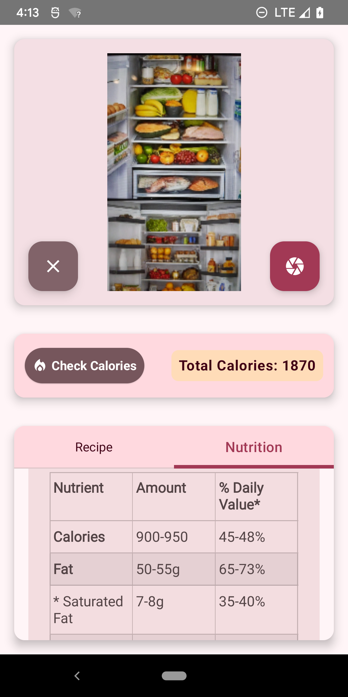

# Gemini Nutritionist - AI-Powered Meal Planning

**Welcome to Gemini Nutritionist!**

This repository contains the codebase for Gemini Nutritionist, an AI-driven mobile app designed to simplify healthy eating and transform weight management.

## What is Gemini Nutritionist?

Gemini Nutritionist automates meal planning by integrating AI with Google Fit, creating customized meal plans based on your fitness goals and the ingredients you have at home.

### How It Works:

1. **Track Your Workouts:**  
   Google Fit to monitor your daily calorie burn.
2. **Scan Your Ingredients:**  
   Use your camera to identify what’s in your fridge.
3. **AI-Powered Meal Plans:**  
   Generate recipes tailored to your workout data and available ingredients.
4. **Cook with Ease:**  
   Access nutritional details and follow voice-guided, step-by-step instructions.

### Key Benefits:

* **Effortless Meal Planning:**  
   No more stress over meal choices or shopping lists.
* **Personalized Nutrition:**  
   Tailored recipes based on your diet and fitness goals.
* **Minimize Food Waste:**  
   Use what you already have to create meals.
* **Simple Weight Management:**  
   Support your weight goals with hassle-free healthy eating.

[YouTube Vid](https://youtu.be/5kw6YISnJjc)  

[Article](https://zoewave.medium.com/your-fridge-is-your-nutritionist-ee694a68918a)

## Getting Started

### Prerequisites:

* Programming Languages: Kotlin - ComposeUI
* Development Tools: Android Studio - Android Studio Ladybug | 2024.2.1 Canary 5
* [Google Fit](https://www.google.com/fit/)
* [Google Health Connect](https://health.google/health-connect-android/)
  
### Setting Up the Development Environment:

1. Clone the repository.
2. Install dependencies.
3. Configure Google Fit / Google Health Connect
4. Gemin API credentials to local.properties

## Contributing

We welcome contributions! Please see the `CONTRIBUTING.md` for guidelines.

## License

This project is licensed under the [GPLv3](https://www.gnu.org/licenses/gpl-3.0.en.html). See the `LICENSE` file for details.

**Stay Tuned!**

We’re continuously enhancing Gemini Nutritionist with new features. Stay connected for updates!

---
